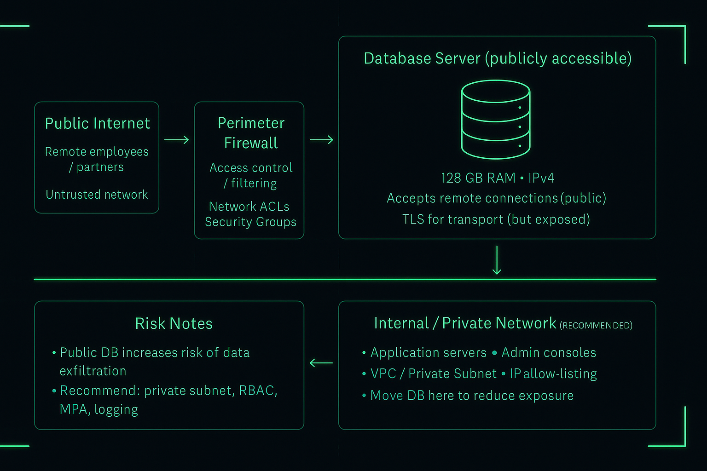

  

  
  
  
  
  

  

# Vulnerability Assessment – Public Database Server

This repository contains a vulnerability assessment of a publicly accessible
database server used by a small e-commerce company. The assessment includes the
system description, scope, purpose, risk analysis, approach, and remediation
strategy using NIST SP 800-30 Rev. 1 framework.

Files:
- `vulnerability_assessment.md` — Full assessment report

  

